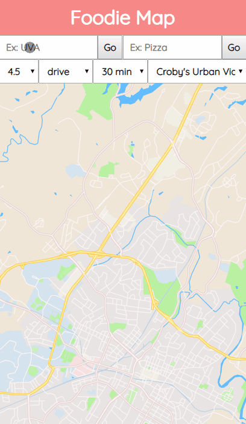
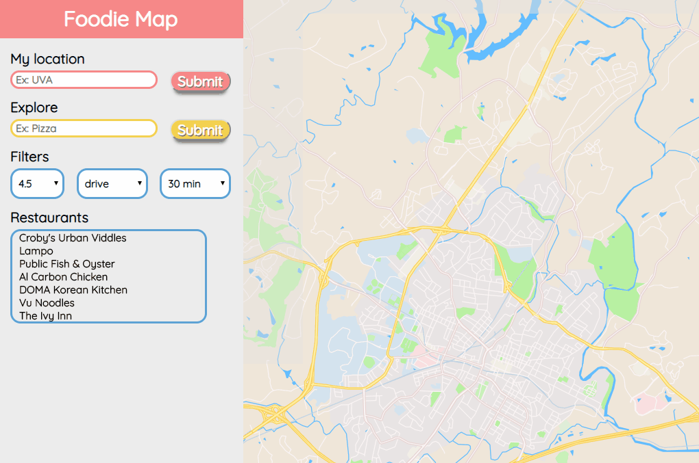

# Neighborhood-Map

A foodie's interactive map app showing you the top places to eat in Charlottesville, VA! Built with React (create-react-app), easy Accessibility, Service Worker offline applications, and APIs provided by Google Maps and Yelp.

## How to run
Launch this [app](https://momothepikachu.github.io/Neighborhood-Map/) in your favorite desktop/mobile browser to find top restaurants near you!

On mobile device:

On desktop:

  
## How to use

 - Enter your current location
 - Enter key words to search for restaurants
 - Select the rating of restaurants, the mode of transportation and the max duration to travel
 - Select the restaurant either from the list-view on the panel or directly click one of the markers on the map
 - In the pop-up infowindow, you view directions by clicking the 'Direction' button, and click the link to view the details of the restaurant on Yelp

## Starting from Scratch
### Basic idea: 
I wanted to create a map app that allow users to find top restaurants in Charlottesville, VA. They can filter the results according to Yelp restaurant rating, distance from their current locations, and the type of food they want to eat. So I sketched the early UI planning and features for both the mobile and desktop versions.

 - Instantly show you a list of restaurants with 4+ stars reviews on Yelp
 - Give directions based on your choices of transportation and duration
 - Enter key words to search for restaurants 
 - Change the rating filter
 - Click on the restaurant's marker to present an info-window
 - Info-window shows restaurant information and a photo its street view
 

### Design with Figma:
I used Figma to turn the sketches to mockups and picked the color schemes.

## Resources:
 - [Customized map styles](https://snazzymaps.com/)
 - [Using Google Map in React Component](https://stackoverflow.com/questions/48493960/using-google-map-in-react-component)
 - [Yelp Search Endpoint with CORS workaround and POSTMAN](https://www.youtube.com/watch?v=0Sy14hX8T-A&list=LLfuPeGEzj_Y5SBiFTHkFyKg&index=2&t=0s)
 - [5 ways to customize Google Maps InfoWindow](http://en.marnoto.com/2014/09/5-formas-de-personalizar-infowindow.html)
 - [cors-anywhere.herokuapp.com not working](https://stackoverflow.com/questions/47076743/cors-anywhere-herokuapp-com-not-working)
